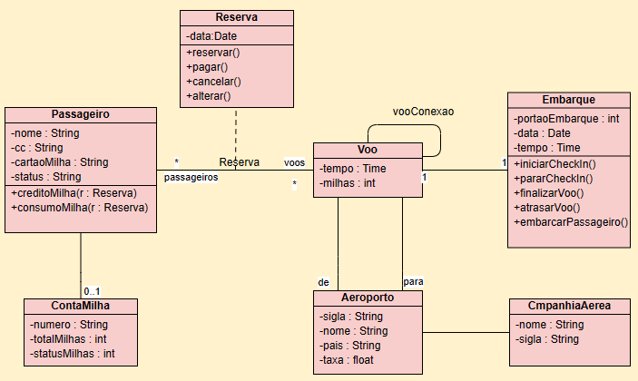

# Prova 1 - Tópicos de Computação

### Grupo: Amadeu Jose Andrade Junior (SC301181X) Renato Porto Morillo (SC3014762), Guilherme Garcia Mancuso (SC3008533).

- Você foi convidado para realizar o desenvolvimento de uma parte de um projeto de software para uma companhia aérea. Para realizar o desenvolvimento, a companhia disponibilizou um diagrama de classes conforme Figura 1, contemplando o que a empresa gostaria que fosse implementado em conformidade com as regras abaixo.
- Reserva de voo é o registro dos dados de um passageiro em uma companhia aérea. Quando você faz uma reserva para um voo, é necessário informar a data do voo e registrar informações nessa classe. Assim, após reservar um voo, é possível: pagar, cancelar ou altera-lo. Para cada uma das possibilidades anteriores durante o desenvolvimento você deve apenas exibir uma mensagem relacionada com o método, por exemplo “Voo pago”, “Voo cancelado ”, “Voo alterado”, etc;
- Passageiro é a classe que registra informações do passageiro além de manipulações de informações de milhas de consumo e credito. Ao realizar uma reserva de um voo o passageiro deverá ter informações em relação ao seu embarque.  Os métodos relacionados ao embarque devem apresentar informações que caracterizem se o check-in foi inicializado ou parado; se o voo está atrasado ou finalizado além de uma mensagem para caracterizar que o embarque vai começar.

O que será avaliado:
- O desenvolvimento utilizando a linguagem TypeScript, uso adequado de tipagem de dados e relação entre as classes (6,0);
- Simulação do projeto (4,0);

Diagrama de Classe:

